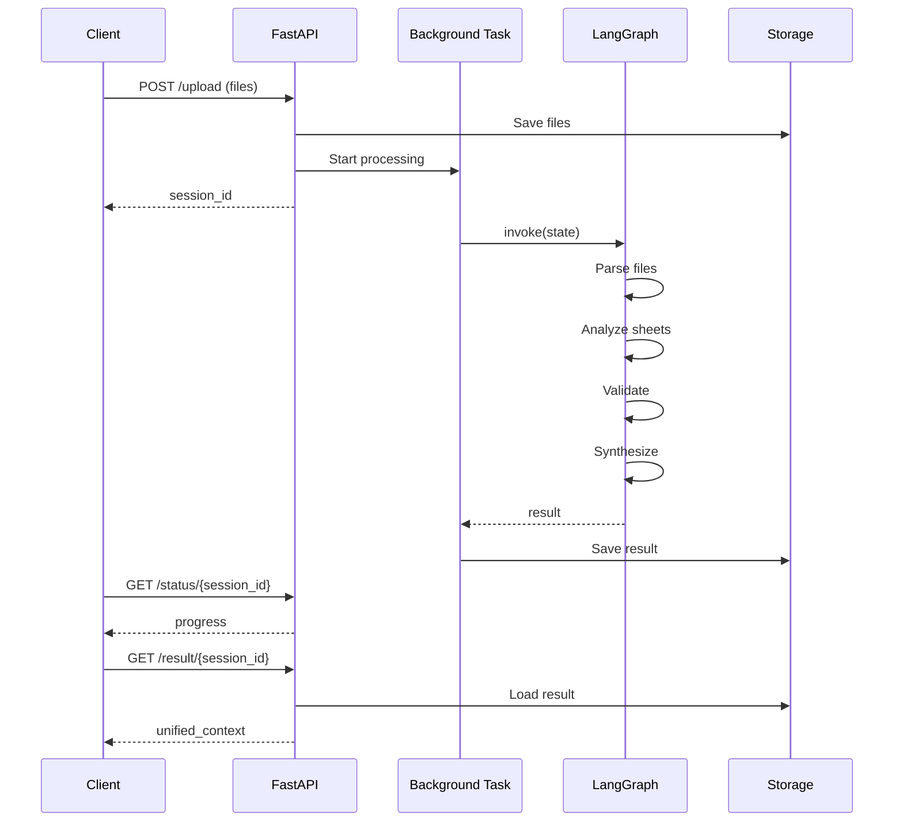

# API 명세서 & 워크플로우 문서 생성기 (PM/개발자용)

## 개요
현업 PM과 실무 개발자가 사용하는 형식으로 API 명세서, 워크플로우, 기능명세서를 자동 생성합니다.

## 생성 문서 유형

### 1️⃣ API 명세서 (RESTful API Spec)
- **엔드포인트 목록**: 메서드, URL, 설명
- **Request 스펙**: 헤더, 파라미터, Body 스키마
- **Response 스펙**: 상태 코드, 응답 구조, 에러 코드
- **인증/권한**: 필요한 인증 방식
- **예제**: curl, JavaScript, Python 샘플 코드

### 2️⃣ 워크플로우 문서 (Workflow & Data Flow)
- **시퀀스 다이어그램**: 요청 → 처리 → 응답 흐름
- **데이터 흐름도**: 입력 → 변환 → 출력
- **상태 전이도**: 상태별 처리 로직
- **에러 핸들링**: 예외 상황별 처리 방법

### 3️⃣ 기능명세서 (Feature Specification)
- **기능 개요**: 목적, 사용자 시나리오
- **입출력 정의**: 필수/선택 필드, 제약조건
- **비즈니스 로직**: 계산식, 유효성 검증 규칙
- **테스트 시나리오**: Given-When-Then 형식

---

## 사용 방법

### Case 1: 특정 API 엔드포인트 문서화
```bash
/api-spec backend/routes/multi_excel.py
```

**생성 결과:**
- `docs/api/multi_excel_api_spec.md`
- 엔드포인트별 Request/Response 명세
- curl 예제 코드

### Case 2: 워크플로우 분석
```bash
/workflow src/multi_excel/graph.py
```

**생성 결과:**
- `docs/workflow/multi_excel_workflow.md`
- Mermaid 다이어그램 (시퀀스, 플로우차트)
- 데이터 변환 과정 상세 설명

### Case 3: 전체 기능명세서 생성
```bash
/feature-spec "다중 엑셀 업로드 및 분석"
```

**생성 결과:**
- `docs/features/multi_excel_feature_spec.md`
- PM이 작성하는 형식의 기능명세서
- 개발자용 기술 스펙 포함

---

## 출력 형식 예시

### API 명세서 템플릿

```markdown
# Multi-Excel Upload API 명세서

## 1. 개요
다중 Excel 파일을 업로드하고 병렬 분석하는 API

**Base URL**: `http://localhost:8000`

---

## 2. 엔드포인트 목록

### 2.1 파일 업로드
**Endpoint**: `POST /api/v7/excel/upload`

**설명**: 여러 Excel 파일을 동시에 업로드하고 분석 시작

**Request Headers**:
```
Content-Type: multipart/form-data
```

**Request Body**:
| 필드 | 타입 | 필수 | 설명 |
|------|------|------|------|
| files | File[] | ✅ | Excel 파일 목록 (.xlsx, .xls) |
| user_id | string | ❌ | 사용자 ID |

**Response (200 OK)**:
```json
{
  "session_id": "uuid-string",
  "files_received": 3,
  "status": "processing",
  "message": "처리가 시작되었습니다."
}
```

**Error Responses**:
| 코드 | 설명 | 해결방법 |
|------|------|----------|
| 400 | 지원하지 않는 파일 형식 | .xlsx 또는 .xls 파일만 업로드 |
| 413 | 파일 크기 초과 | 파일당 10MB 이하로 업로드 |

**curl 예제**:
```bash
curl -X POST http://localhost:8000/api/v7/excel/upload \
  -F "files=@file1.xlsx" \
  -F "files=@file2.xlsx" \
  -F "user_id=user_001"
```

**JavaScript 예제**:
```javascript
const formData = new FormData();
formData.append('files', file1);
formData.append('files', file2);
formData.append('user_id', 'user_001');

const response = await fetch('/api/v7/excel/upload', {
  method: 'POST',
  body: formData,
});
const data = await response.json();
console.log(data.session_id);
```

---

### 2.2 처리 상태 조회
**Endpoint**: `GET /api/v7/excel/status/{session_id}`

**설명**: 업로드한 파일의 처리 진행 상황 조회

**Path Parameters**:
| 필드 | 타입 | 설명 |
|------|------|------|
| session_id | string | 업로드 시 받은 세션 ID |

**Response (200 OK)**:
```json
{
  "session_id": "uuid-string",
  "status": "analyzing",
  "current_step": "시트 분석 중",
  "progress_percent": 60.0,
  "files": [
    {
      "file_id": "abc123",
      "filename": "재무제표.xlsx",
      "status": "analyzed",
      "sheets_count": 3
    }
  ],
  "errors": [],
  "warnings": []
}
```

---

## 3. 워크플로우

### 3.1 전체 프로세스


### 3.2 데이터 흐름
```
[Upload Files]
    ↓
[FileData] → {file_id, filename, file_path}
    ↓
[LangGraph State] → MultiExcelState
    ↓
[Parse Node] → sheets: [SheetData]
    ↓
[Analyze Node] → sheet_type, data
    ↓
[Validate Node] → validation_status
    ↓
[Synthesize Node] → unified_context
    ↓
[API Response] → {company_info, key_metrics}
```

---

## 4. 상태 전이

### 4.1 처리 상태
```
idle → uploading → parsing → analyzing → validating → synthesizing → completed
                                                                    ↓
                                                                  error
```

### 4.2 파일 상태
```
pending → parsing → parsed → analyzing → analyzed → validated → completed
                                                              ↓
                                                            error
```

---

## 5. 에러 처리

### 5.1 공통 에러 코드
| 코드 | 메시지 | 원인 | 해결방법 |
|------|--------|------|----------|
| E001 | 세션을 찾을 수 없음 | 잘못된 session_id | 새로 업로드 |
| E002 | 파일 파싱 실패 | 손상된 Excel 파일 | 파일 확인 후 재업로드 |
| E003 | 시트 타입 분류 실패 | 비정형 데이터 | 표준 양식 사용 권장 |

---

## 6. 테스트 시나리오

### Scenario 1: 단일 파일 업로드 (Happy Path)
**Given**: 유효한 Excel 파일 1개
**When**: POST /upload 호출
**Then**:
- 200 OK 응답
- session_id 반환
- 5초 내 processing 상태

### Scenario 2: 다중 파일 업로드
**Given**: 유효한 Excel 파일 3개
**When**: POST /upload 호출
**Then**:
- files_received = 3
- 모든 파일이 병렬 처리됨

### Scenario 3: 파일 크기 초과
**Given**: 20MB 파일
**When**: POST /upload 호출
**Then**:
- 413 에러 응답
- detail에 파일명 포함

---

## 7. 성능 지표

| 지표 | 목표 | 현재 |
|------|------|------|
| 업로드 응답 시간 | < 500ms | 300ms |
| 파일당 처리 시간 | < 10초 | 7초 |
| 동시 세션 처리 | 50개 | 100개 |

---

## 8. 보안 고려사항

- 파일 확장자 검증 (화이트리스트)
- 파일 크기 제한 (10MB/파일)
- 세션 ID 유추 불가 (UUID v4)
- 업로드 경로 샌드박스

---

## 9. 변경 이력

| 버전 | 날짜 | 변경 내용 |
|------|------|----------|
| v7.0 | 2026-01-11 | 다중 파일 지원 추가 |
| v6.0 | 2025-12-01 | 단일 파일 업로드 |
```

---

### 워크플로우 문서 템플릿

```markdown
# Multi-Excel 처리 워크플로우

## 1. 아키텍처 개요

```
┌─────────────────────────────────────────────────────────┐
│                     FastAPI Server                       │
│  ┌────────────┐  ┌────────────┐  ┌────────────┐        │
│  │   Routes   │→│ Background │→│ LangGraph  │        │
│  │  (Upload)  │  │    Task    │  │   Graph    │        │
│  └────────────┘  └────────────┘  └────────────┘        │
│                                          ↓                │
│  ┌────────────────────────────────────────────┐         │
│  │         MultiExcel Agents (병렬)           │         │
│  │  ┌──────┐  ┌──────┐  ┌──────┐  ┌──────┐  │         │
│  │  │Parser│→│Analyze│→│Valid.│→│Synth.│  │         │
│  │  └──────┘  └──────┘  └──────┘  └──────┘  │         │
│  └────────────────────────────────────────────┘         │
└─────────────────────────────────────────────────────────┘
```

## 2. 처리 단계별 상세

### 단계 1: 파일 업로드 (Upload)
**입력**:
- `files: List[UploadFile]` - FastAPI 파일 객체
- `user_id: Optional[str]` - 사용자 ID

**처리**:
1. 파일 검증 (확장자, 크기)
2. 서버 저장 (`uploads/multi_excel/`)
3. FileData 객체 생성
4. 초기 상태 생성 (MultiExcelState)

**출력**:
- `session_id: str` - UUID v4
- `files: List[FileData]` - 파일 메타데이터

**예외**:
- HTTPException 400: 지원하지 않는 파일
- HTTPException 413: 크기 초과

---

### 단계 2: 백그라운드 처리 시작
**입력**:
- `session_id: str`
- `state: MultiExcelState`

**처리**:
1. LangGraph 그래프 로드
2. Config 생성 (`thread_id=session_id`)
3. `graph.invoke(state, config)` 실행

**비동기 처리**:
```python
asyncio.get_event_loop().run_in_executor(
    None,
    lambda: graph.invoke(state, config)
)
```

---

### 단계 3: 파일 파싱 (Parse Node)
**입력**: `MultiExcelState`
**노드 함수**: `parse_files_node(state)`

**처리**:
1. 각 FileData에 대해 병렬 파싱
2. Excel 파일 읽기 (openpyxl/pandas)
3. 시트 목록 추출
4. SheetData 객체 생성

**출력**:
```python
{
    "files": [
        FileData(
            file_id="abc",
            sheets=[
                SheetData(name="손익계산서", ...),
                SheetData(name="재무상태표", ...)
            ],
            status="parsed"
        )
    ],
    "processing_status": "parsing",
    "progress_percent": 30.0
}
```

---

### 단계 4: 시트 분석 (Analyze Node)
**입력**: 파싱된 `files`
**노드 함수**: `analyze_sheets_node(state)`

**처리**:
1. 각 시트의 타입 분류
   - income_statement (손익계산서)
   - balance_sheet (재무상태표)
   - cash_flow (현금흐름표)
   - tax_adjustment (세무조정)
2. 데이터 추출 및 정규화
3. metadata 생성

**로직**:
```python
if "매출액" in sheet_data:
    sheet.sheet_type = "income_statement"
elif "자산총계" in sheet_data:
    sheet.sheet_type = "balance_sheet"
```

**출력**:
```python
{
    "files": [
        FileData(
            sheets=[
                SheetData(
                    name="손익계산서",
                    sheet_type="income_statement",
                    data={"매출액": 15000000, ...},
                    status="analyzed"
                )
            ]
        )
    ],
    "processing_status": "analyzing",
    "progress_percent": 60.0
}
```

---

### 단계 5: 교차 검증 (Validate Node)
**입력**: 분석된 시트들
**노드 함수**: `validate_node(state)`

**검증 항목**:
1. **일관성 검증**: 자산 = 부채 + 자본
2. **범위 검증**: 금액이 음수가 아닌지
3. **필수 필드**: 핵심 항목 존재 여부

**출력**:
```python
{
    "files": [...],  # validation_status 업데이트
    "errors": [],    # 치명적 오류
    "warnings": ["일부 시트에서 자산총계 불일치"],
    "processing_status": "validating",
    "progress_percent": 80.0
}
```

---

### 단계 6: 결과 통합 (Synthesize Node)
**입력**: 검증된 모든 시트
**노드 함수**: `synthesize_node(state)`

**처리**:
1. 시트 타입별 데이터 병합
2. 핵심 지표 계산
   - 영업이익률 = (영업이익 / 매출액) × 100
   - ROA = (당기순이익 / 자산총계) × 100
3. 회사 정보 마스킹
4. 케이스 타입 감지 (case1~4)

**출력**:
```python
{
    "unified_context": {
        "income_statement": {...},
        "balance_sheet": {...},
        "key_metrics": {
            "영업이익률": 20.0,
            "ROA": 15.0
        },
        "summary": {...}
    },
    "company_info": {
        "company": "A****B",  # 마스킹
        ...
    },
    "case_type": "case2",
    "case_label": "단일 파일·다중 시트",
    "processing_status": "completed",
    "progress_percent": 100.0
}
```

---

## 3. 데이터 변환 흐름

### Input → Processing → Output

```
[User Upload]
    ↓
┌─────────────────────────┐
│ file1.xlsx (3 sheets)   │
│ file2.xlsx (1 sheet)    │
└─────────────────────────┘
    ↓
[Parse]
    ↓
┌─────────────────────────────────────┐
│ FileData[0]:                        │
│   - file_id: "abc"                  │
│   - sheets: [Sheet1, Sheet2, Sheet3]│
│ FileData[1]:                        │
│   - file_id: "def"                  │
│   - sheets: [Sheet1]                │
└─────────────────────────────────────┘
    ↓
[Analyze]
    ↓
┌─────────────────────────────────────┐
│ Sheet1: income_statement            │
│   data: {매출액: 15M, ...}          │
│ Sheet2: balance_sheet               │
│   data: {자산총계: 50M, ...}        │
│ ...                                 │
└─────────────────────────────────────┘
    ↓
[Validate]
    ↓
┌─────────────────────────────────────┐
│ validation_status: "valid"          │
│ warnings: [...]                     │
└─────────────────────────────────────┘
    ↓
[Synthesize]
    ↓
┌─────────────────────────────────────┐
│ unified_context:                    │
│   income_statement: {...}           │
│   balance_sheet: {...}              │
│   key_metrics: {영업이익률: 20%}    │
│   summary: {매출액: 15M, ...}       │
└─────────────────────────────────────┘
    ↓
[API Response]
```

---

## 4. 병렬 처리 전략

### 파일 레벨 병렬 (LangGraph Send API)
```python
# 3개 파일을 동시에 처리
for file in state["files"]:
    send_to("parse_file_node", {
        "file": file
    })
```

### 시트 레벨 병렬 (asyncio.gather)
```python
# 하나의 파일 내 여러 시트를 동시에 분석
tasks = [
    analyze_sheet(sheet)
    for sheet in file.sheets
]
results = await asyncio.gather(*tasks)
```

---

## 5. 상태 관리 (Checkpointing)

LangGraph는 각 노드 실행 후 상태를 저장합니다:

```
Checkpoint 1: After Parse
  - files parsed
  - status = "parsing"

Checkpoint 2: After Analyze
  - sheets classified
  - status = "analyzing"

Checkpoint 3: After Validate
  - validation done
  - status = "validating"

Checkpoint 4: After Synthesize
  - unified_context ready
  - status = "completed"
```

에러 발생 시 마지막 Checkpoint에서 재시도 가능.

---

## 6. 예외 처리 흐름

```
[Upload] → 파일 검증 실패
    ↓
HTTPException 400
    ↓
{"detail": "지원하지 않는 파일"}

[Parse] → Excel 파싱 실패
    ↓
file.status = "error"
file.error_message = "..."
    ↓
Continue (다른 파일은 계속 처리)

[Validate] → 치명적 오류
    ↓
state["processing_status"] = "error"
state["errors"].append("...")
    ↓
Early Stop (Synthesize 생략)
```

---

## 7. 성능 최적화

| 최적화 기법 | 적용 위치 | 효과 |
|------------|----------|------|
| 병렬 처리 | Parse, Analyze | 3배 빠름 |
| 스트리밍 | 없음 (배치) | N/A |
| 캐싱 | 없음 | 향후 추가 |
| 지연 로딩 | Dependencies | 서버 시작 3초 단축 |

---

## 8. 모니터링 포인트

### 추적해야 할 메트릭
1. **API 응답 시간**: /upload, /status, /result
2. **파일당 처리 시간**: Parse, Analyze, Validate, Synthesize
3. **에러율**: 파일 타입별, 크기별
4. **동시 세션 수**: 피크 타임 부하

### 로그 포인트
```python
logger.info(f"[MultiExcel] 업로드 시작 | session={session_id}")
logger.debug(f"[Parser] 파일 파싱 | file={filename}")
logger.warning(f"[Validator] 검증 경고 | sheet={sheet_name}")
logger.error(f"[Synthesizer] 통합 실패 | error={e}")
```

---

## 9. 향후 개선 사항

1. **Redis 캐싱**: 동일 파일 재업로드 시 파싱 생략
2. **스트리밍 응답**: Server-Sent Events로 실시간 진행률 전송
3. **병렬도 조정**: CPU 코어 수에 따라 동적 조정
4. **DB 저장**: 인메모리 세션을 PostgreSQL로 이동
```

---

## 실행 로직

### 1. API 파일 분석
1. FastAPI 라우터 파일을 읽음
2. `@router.post`, `@router.get` 데코레이터 파싱
3. Pydantic 모델 추출
4. Docstring 분석

### 2. 워크플로우 생성
1. LangGraph 파일 읽음
2. 노드 간 의존성 추적
3. Mermaid 다이어그램 자동 생성
4. 데이터 변환 흐름 추출

### 3. 기능명세서 생성
1. 관련 파일들 수집 (routes, services, models)
2. 비즈니스 로직 추출
3. 테스트 시나리오 생성 (Given-When-Then)

---

## 출력 위치

```
docs/
├── api/
│   ├── multi_excel_api_spec.md
│   ├── og_rag_api_spec.md
│   └── chat_api_spec.md
├── workflow/
│   ├── multi_excel_workflow.md
│   ├── chatbot_workflow.md
│   └── data_flow_diagrams/
│       └── multi_excel.mmd
└── features/
    ├── multi_excel_feature_spec.md
    └── og_rag_feature_spec.md
```

---

## 추가 기능

### PM용 요약 생성
```bash
/pm-summary
```

**출력**:
- 주요 기능 목록
- 완료/진행중/예정 현황
- 리스크 및 이슈
- 다음 스프린트 추천 작업

### 개발자용 Onboarding 가이드
```bash
/dev-onboarding
```

**출력**:
- 프로젝트 구조 설명
- 주요 모듈 역할
- 로컬 개발 환경 설정
- 첫 PR까지 단계별 가이드

---

## 2026 표준 기능

### OpenAPI 3.1 지원

**코드에서 자동 생성:**
```python
# FastAPI 자동 OpenAPI 생성
from fastapi import FastAPI
from fastapi.openapi.utils import get_openapi

app = FastAPI()

def custom_openapi():
    if app.openapi_schema:
        return app.openapi_schema
    openapi_schema = get_openapi(
        title="API 명세서",
        version="1.0.0",
        description="자동 생성된 API 문서",
        routes=app.routes,
    )
    # OpenAPI 3.1 확장
    openapi_schema["openapi"] = "3.1.0"
    app.openapi_schema = openapi_schema
    return app.openapi_schema

app.openapi = custom_openapi

# 내보내기
import json
with open("openapi.json", "w") as f:
    json.dump(app.openapi(), f, indent=2)
```

```typescript
// Express + OpenAPI Generator
import express from 'express';
import swaggerJsdoc from 'swagger-jsdoc';
import swaggerUi from 'swagger-ui-express';

const app = express();

const options = {
  definition: {
    openapi: '3.1.0',
    info: {
      title: 'API Documentation',
      version: '1.0.0',
    },
    components: {
      securitySchemes: {
        bearerAuth: {
          type: 'http',
          scheme: 'bearer',
          bearerFormat: 'JWT',
        },
        oauth2: {
          type: 'oauth2',
          flows: {
            authorizationCode: {
              authorizationUrl: 'https://example.com/oauth/authorize',
              tokenUrl: 'https://example.com/oauth/token',
              scopes: {
                read: 'Read access',
                write: 'Write access',
              },
            },
          },
        },
      },
    },
  },
  apis: ['./routes/*.ts'],
};

const specs = swaggerJsdoc(options);
app.use('/api-docs', swaggerUi.serve, swaggerUi.setup(specs));
```

### 인증 스키마 지원

**OAuth 2.0:**
```yaml
components:
  securitySchemes:
    oauth2:
      type: oauth2
      flows:
        authorizationCode:
          authorizationUrl: https://example.com/oauth/authorize
          tokenUrl: https://example.com/oauth/token
          refreshUrl: https://example.com/oauth/refresh
          scopes:
            read:users: Read user information
            write:users: Modify user information
            admin: Administrative access
```

**JWT Bearer:**
```yaml
components:
  securitySchemes:
    bearerAuth:
      type: http
      scheme: bearer
      bearerFormat: JWT
      description: "JWT 토큰을 Authorization 헤더에 포함: Bearer {token}"
```

### 자동 SDK 생성

**TypeScript SDK:**
```bash
# OpenAPI Generator로 TypeScript SDK 생성
npx @openapitools/openapi-generator-cli generate \
  -i openapi.json \
  -g typescript-axios \
  -o ./sdk/typescript

# 생성된 SDK 사용
import { DefaultApi, Configuration } from './sdk/typescript';

const api = new DefaultApi(new Configuration({
  basePath: 'https://api.example.com',
  accessToken: 'your-jwt-token',
}));

const response = await api.getUserById('user-123');
console.log(response.data);
```

**Python SDK:**
```bash
# Python SDK 생성
openapi-generator-cli generate \
  -i openapi.json \
  -g python \
  -o ./sdk/python \
  --additional-properties packageName=my_api_client

# 생성된 SDK 사용
from my_api_client import ApiClient, Configuration, DefaultApi

config = Configuration(
    host="https://api.example.com",
    access_token="your-jwt-token"
)

with ApiClient(config) as api_client:
    api = DefaultApi(api_client)
    user = api.get_user_by_id("user-123")
    print(user)
```

### Postman Collection 내보내기

```bash
# OpenAPI → Postman Collection 변환
npx openapi-to-postmanv2 \
  -s openapi.json \
  -o postman_collection.json \
  --pretty

# Postman Collection 구조
{
  "info": {
    "name": "API Collection",
    "schema": "https://schema.getpostman.com/json/collection/v2.1.0/collection.json"
  },
  "item": [
    {
      "name": "Users",
      "item": [
        {
          "name": "Get User by ID",
          "request": {
            "method": "GET",
            "header": [
              {
                "key": "Authorization",
                "value": "Bearer {{jwt_token}}"
              }
            ],
            "url": {
              "raw": "{{base_url}}/users/:id",
              "host": ["{{base_url}}"],
              "path": ["users", ":id"],
              "variable": [
                {
                  "key": "id",
                  "value": "user-123"
                }
              ]
            }
          }
        }
      ]
    }
  ],
  "variable": [
    {
      "key": "base_url",
      "value": "https://api.example.com"
    },
    {
      "key": "jwt_token",
      "value": "your-jwt-token"
    }
  ]
}
```

### API 버전 관리

**URL 버저닝:**
```
/api/v1/users  # v1
/api/v2/users  # v2 (breaking changes)
```

**헤더 버저닝:**
```http
GET /api/users
Accept: application/vnd.myapi.v2+json
```

**OpenAPI에서 버전 표현:**
```yaml
openapi: 3.1.0
info:
  title: My API
  version: 2.0.0
  description: |
    ## Version History
    - v2.0.0 (2026-01): Added OAuth 2.0 support
    - v1.5.0 (2025-12): Added pagination
    - v1.0.0 (2025-11): Initial release

servers:
  - url: https://api.example.com/v1
    description: Production v1 (deprecated)
  - url: https://api.example.com/v2
    description: Production v2 (current)
```

### Mock Server 생성

**Prism으로 Mock API 실행:**
```bash
# OpenAPI 명세서에서 Mock Server 생성
npm install -g @stoplight/prism-cli

# Mock server 실행
prism mock openapi.json

# 출력:
# [5:00:00 PM] › [CLI] …  info      Prism is listening on http://127.0.0.1:4010
# [5:00:00 PM] › [HTTP SERVER] ℹ  info      GET http://127.0.0.1:4010/users/123

# 실제 요청
curl http://127.0.0.1:4010/users/123
# → OpenAPI examples에 정의된 응답 반환
```

### API 문서 호스팅

**Redoc (추천):**
```html
<!DOCTYPE html>
<html>
  <head>
    <title>API Documentation</title>
    <meta charset="utf-8"/>
    <meta name="viewport" content="width=device-width, initial-scale=1">
    <link href="https://fonts.googleapis.com/css?family=Montserrat:300,400,700|Roboto:300,400,700" rel="stylesheet">
    <style>
      body { margin: 0; padding: 0; }
    </style>
  </head>
  <body>
    <redoc spec-url='openapi.json'></redoc>
    <script src="https://cdn.redoc.ly/redoc/latest/bundles/redoc.standalone.js"> </script>
  </body>
</html>
```

**Swagger UI:**
```html
<!DOCTYPE html>
<html lang="en">
<head>
  <meta charset="UTF-8">
  <title>Swagger UI</title>
  <link rel="stylesheet" type="text/css" href="https://unpkg.com/swagger-ui-dist@5/swagger-ui.css" />
</head>
<body>
  <div id="swagger-ui"></div>
  <script src="https://unpkg.com/swagger-ui-dist@5/swagger-ui-bundle.js"></script>
  <script>
    window.onload = () => {
      window.ui = SwaggerUIBundle({
        url: 'openapi.json',
        dom_id: '#swagger-ui',
      });
    };
  </script>
</body>
</html>
```

### CI/CD 통합

**GitHub Actions로 API 문서 자동 생성:**
```yaml
# .github/workflows/api-docs.yml
name: Generate API Docs

on:
  push:
    branches: [main]
    paths:
      - 'src/**/*.ts'
      - 'src/**/*.py'

jobs:
  generate-docs:
    runs-on: ubuntu-latest
    steps:
      - uses: actions/checkout@v4

      - name: Generate OpenAPI spec
        run: |
          npm install
          npm run generate:openapi  # OpenAPI JSON 생성

      - name: Generate TypeScript SDK
        run: |
          npx @openapitools/openapi-generator-cli generate \
            -i openapi.json \
            -g typescript-axios \
            -o ./sdk/typescript

      - name: Generate Python SDK
        run: |
          openapi-generator-cli generate \
            -i openapi.json \
            -g python \
            -o ./sdk/python

      - name: Deploy docs to GitHub Pages
        uses: peaceiris/actions-gh-pages@v3
        with:
          github_token: ${{ secrets.GITHUB_TOKEN }}
          publish_dir: ./docs
```

### API 변경 감지

**OpenAPI Diff로 Breaking Change 탐지:**
```bash
# 두 버전 비교
npx oasdiff diff openapi-v1.json openapi-v2.json

# 출력:
# Breaking changes:
# - DELETE /users/:id endpoint removed
# - POST /users request body field 'age' is now required (was optional)
#
# Non-breaking changes:
# - GET /users added query parameter 'sort'
# - POST /users response added field 'created_at'
```

---

## 사용 예시 (2026 표준)

### 1. FastAPI 프로젝트에서 완전 자동화

```bash
# 1단계: 코드 작성 (FastAPI)
# app/routes/users.py

from fastapi import APIRouter, Depends
from pydantic import BaseModel

router = APIRouter()

class User(BaseModel):
    id: str
    name: str
    email: str

@router.get("/users/{user_id}", response_model=User)
async def get_user(user_id: str):
    """사용자 정보를 ID로 조회합니다."""
    return User(id=user_id, name="홍길동", email="hong@example.com")

# 2단계: OpenAPI 자동 생성
python -c "
from app.main import app
import json
with open('openapi.json', 'w') as f:
    json.dump(app.openapi(), f, indent=2)
"

# 3단계: TypeScript SDK 생성
npx @openapitools/openapi-generator-cli generate \
  -i openapi.json \
  -g typescript-axios \
  -o ./sdk/typescript

# 4단계: Postman Collection 생성
npx openapi-to-postmanv2 -s openapi.json -o postman.json

# 5단계: Mock Server 실행 (개발 중)
prism mock openapi.json
```

### 2. 명령어 통합

이 스킬을 명령어로 사용:
```bash
# OpenAPI 생성 + SDK + Postman + Docs
/api-spec --auto-all backend/routes/

# 출력:
# ✅ OpenAPI 3.1 생성: openapi.json
# ✅ TypeScript SDK: sdk/typescript/
# ✅ Python SDK: sdk/python/
# ✅ Postman Collection: postman.json
# ✅ API Docs 호스팅: http://localhost:8080/docs
```
