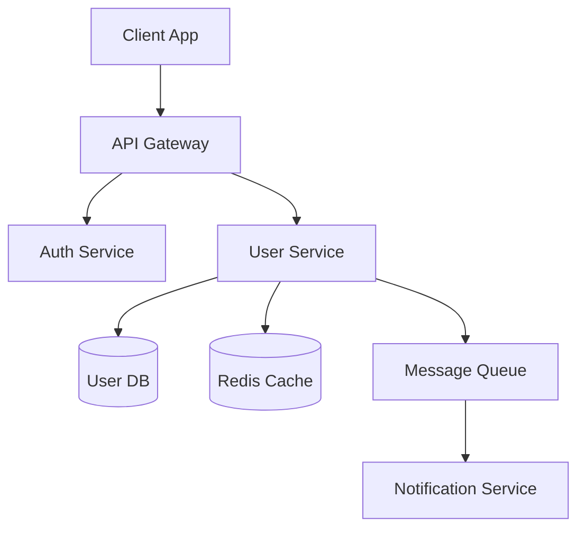
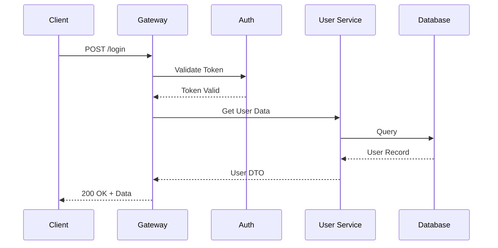

# Architecture Design Skill — Staff+ Engineer Level

## 목적
시스템 아키텍처를 설계하고, 기술 결정을 문서화하며,
트레이드오프를 명시적으로 분석한다.

## 설계 프로세스

### Phase 1: 요구사항 정리
아키텍처 설계 전 반드시 확인:

```
1. 기능 요구사항 (Functional)
   - 핵심 유즈케이스 목록
   - 데이터 모델 핵심 엔티티

2. 비기능 요구사항 (Non-Functional)
   - 예상 트래픽/부하 (QPS, 동시접속)
   - 지연시간 요구사항 (p50, p99)
   - 가용성 목표 (99.9%? 99.99%?)
   - 데이터 일관성 요구 수준 (강한 일관성 vs 최종 일관성)
   - 보안/컴플라이언스 요구사항

3. 제약사항 (Constraints)
   - 팀 규모 및 기술 스택 역량
   - 예산 및 인프라 제약
   - 기존 시스템과의 통합 요구
   - 타임라인
```

### Phase 2: 아키텍처 패턴 선택

프로젝트 규모와 요구사항에 따라 적절한 패턴 제안:

| 상황 | 추천 패턴 |
|------|----------|
| 소규모, 빠른 출시 | Modular Monolith |
| 독립 배포 필요한 팀 | Microservices |
| 이벤트 중심 비동기 | Event-Driven Architecture |
| CRUD 위주 복잡 도메인 | Clean/Hexagonal Architecture |
| 읽기/쓰기 패턴 극단적 차이 | CQRS + Event Sourcing |
| 실시간 데이터 파이프라인 | Streaming Architecture |

### Phase 3: 설계 문서 작성

#### 시스템 구성도
Mermaid 다이어그램으로 시각화:


#### 데이터 플로우
주요 시나리오별 시퀀스 다이어그램 작성:


## ADR (Architecture Decision Record) 템플릿

모든 중요한 기술 결정은 ADR로 문서화:

```markdown
# ADR-{번호}: {결정 제목}

## Status
Proposed | Accepted | Deprecated | Superseded by ADR-{번호}

## Context
어떤 상황에서 이 결정이 필요한지 설명.
기술적 배경, 비즈니스 맥락, 제약사항 포함.

## Decision
무엇을 결정했는지 명확하게 기술.
"We will use X for Y because Z."

## Alternatives Considered

### Option A: {대안 1}
- ✅ 장점: ...
- ❌ 단점: ...
- 비용/복잡도: Low / Medium / High

### Option B: {대안 2}
- ✅ 장점: ...
- ❌ 단점: ...
- 비용/복잡도: Low / Medium / High

## Consequences

### Positive
- ...

### Negative
- ...

### Risks
- Risk: ... → Mitigation: ...

## References
- 관련 RFC, 문서, 벤치마크 링크
```

ADR 파일 위치: `docs/adr/` 디렉토리, 파일명 `NNNN-kebab-case-title.md`

## 디렉토리 구조 템플릿

### Clean Architecture (TypeScript)
```
src/
├── domain/            # 엔티티, 값 객체, 도메인 서비스
│   ├── entities/
│   ├── value-objects/
│   └── services/
├── application/       # 유즈케이스, 포트(인터페이스)
│   ├── use-cases/
│   ├── ports/
│   └── dtos/
├── infrastructure/    # 외부 시스템 어댑터
│   ├── persistence/
│   ├── http/
│   └── messaging/
└── presentation/      # API 컨트롤러, CLI
    ├── rest/
    ├── graphql/
    └── cli/
```

### 의존성 규칙
```
presentation → application → domain
infrastructure → application (implements ports)

domain은 어떤 외부 레이어도 import하지 않는다.
application은 domain만 import한다.
infrastructure는 application의 port를 구현한다.
```

## 트레이드오프 분석 프레임워크

모든 아키텍처 결정은 다음 축으로 분석:

```
                    ┌─ 개발 속도 (Velocity)
                    ├─ 운영 복잡도 (Operational Complexity)
  Trade-off Axes ───├─ 확장성 (Scalability)
                    ├─ 일관성 (Consistency)
                    ├─ 비용 (Cost)
                    └─ 팀 역량 적합도 (Team Fit)
```

항상 "왜 이 트레이드오프를 선택했는가"를 문서화한다.

## 중요 원칙
- 과도한 설계(over-engineering) 경계. YAGNI 적용.
- "나중에 바꿀 수 있는가?"를 항상 고려. 되돌릴 수 있는 결정은 빠르게, 되돌릴 수 없는 결정은 신중하게.
- 팀의 현재 역량 수준을 고려한 현실적 설계.
- 다이어그램은 Mermaid로 코드와 함께 버전 관리.
